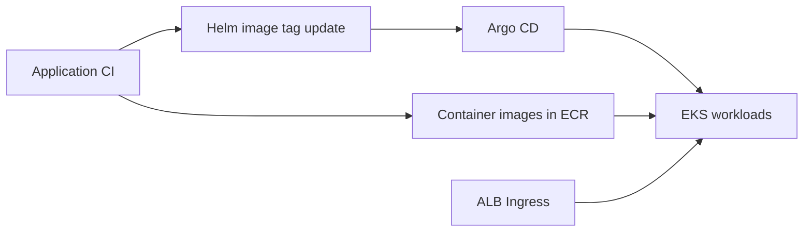

# Factory Tycoon - Kubernetes

[한국어](README.md) | **English**

Factory Tycoon is a team project that connects factory operations, IoT sensor monitoring, anomaly detection, and AI analysis. Its repositories cover data collection, backend services, the web interface, and cloud deployment.

**Helm charts and Kubernetes manifests for deploying three backend services to EKS.** This repository defines service ports, container images, resources, health checks, and Ingress routing.

## Services

| Service | Helm chart | Port | Ingress path |
| --- | --- | --- | --- |
| `sf-backend` | `helm/factory-tycoon-backend` | 8080 | `/api` |
| `sf-backend-aws` | `helm/factory-tycoon-aws` | 8081 | `/aws` |
| `sf-backend-websocket` | `helm/factory-tycoon-websocket` | 8000 | `/ws` |

The WebSocket endpoints are `/ws/sensor` and `/ws/alert`. Charts default to two replicas and select nodes labeled `role: backend`.

## Deployment flow



Argo CD applications and runtime ConfigMaps/Secrets are configured in the Cloud repository's `argocd/` directory. Charts here reference those resources.

## Configuration highlights

- **Separate charts**: independent deployment definitions for the main API, AWS API, and WebSocket service
- **Environment values**: all three charts include `values-prod.yaml`; the main backend also includes `values-dev.yaml`
- **Health checks**: Actuator HTTP probes for Java services and TCP probes for WebSocket
- **Path routing**: ALB Ingress routes `/api`, `/aws`, and `/ws` to their services
- **Image versions**: production values track container image tags

## Prepare deployment

You need EKS access, kubectl, Helm, ECR images, and the AWS Load Balancer Controller. Adapt these settings first:

- Image repositories, service account role ARNs, and `nodeSelector` in `values.yaml`
- ConfigMaps and Secrets created by the Cloud repository
- Argo CD repository URLs and synchronization paths

Image repositories and role ARNs currently reference the project's AWS account. Related CI and Argo CD configuration still reference the previous organization (`lgcns5team`); verify the actual synchronization target.

## Render and deploy with Helm

Inspect rendered resources from the repository root:

```bash
helm template factory-backend ./helm/factory-tycoon-backend \
  -f ./helm/factory-tycoon-backend/values-prod.yaml
```

Once runtime configuration and dependencies are available:

```bash
helm upgrade --install factory-backend ./helm/factory-tycoon-backend \
  -f ./helm/factory-tycoon-backend/values-prod.yaml -n default
helm upgrade --install factory-aws ./helm/factory-tycoon-aws \
  -f ./helm/factory-tycoon-aws/values-prod.yaml -n default
helm upgrade --install factory-websocket ./helm/factory-tycoon-websocket \
  -f ./helm/factory-tycoon-websocket/values-prod.yaml -n default
```

In a GitOps environment, let Argo CD synchronize the charts. Choose a deployment method so that manual Helm releases and Argo CD do not manage the same resources simultaneously.

## Repository layout and operations

- [helm](helm): service Helm charts
- [ingress](ingress): ALB Ingress manifests, currently configured for HTTP
- [be-factory](be-factory), [be-aws](be-aws), [be-websocket](be-websocket): manifests for direct deployment

```bash
kubectl get pods,svc,ingress -n default
kubectl logs -f -l app.kubernetes.io/name=factory-tycoon-backend -n default
```

Production values contain `autoscaling` settings, but the charts currently have no HPA template. Those values alone do not create autoscaling resources. For GitOps rollback, revert the image tag change and synchronize; for manual Helm deployment, use the release history.

## Related repositories

| Repository | Role |
| --- | --- |
| [factory-tycoon-frontend](https://github.com/factorytycoon/factory-tycoon-frontend) | Web dashboard and 3D factory visualization |
| [factory-tycoon-backend](https://github.com/factorytycoon/factory-tycoon-backend) | Factory operations and authentication API |
| [factory-tycoon-backend-aws](https://github.com/factorytycoon/factory-tycoon-backend-aws) | Bedrock AI analysis and S3/OpenSearch integration |
| [factory-tycoon-backend-websocket](https://github.com/factorytycoon/factory-tycoon-backend-websocket) | Live sensor and alert delivery |
| [factory-tycoon-sensor-simulator](https://github.com/factorytycoon/factory-tycoon-sensor-simulator) | Simulated sensor data and MQTT publishing |
| [factory-tycoon-opensearch](https://github.com/factorytycoon/factory-tycoon-opensearch) | Anomaly detection and alert configuration assets |
| [factory-tycoon-cloud](https://github.com/factorytycoon/factory-tycoon-cloud) | AWS infrastructure and Lambda with Terraform |
| [factory-tycoon-k8s](https://github.com/factorytycoon/factory-tycoon-k8s) | Helm and Kubernetes deployment configuration |
