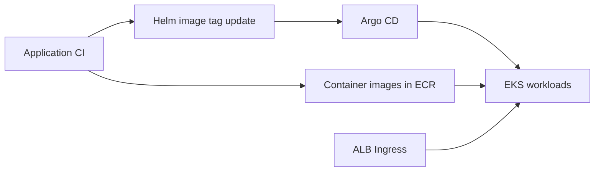

# Factory Tycoon - Kubernetes

**한국어** | [English](README.en.md)

Factory Tycoon은 공장 운영 관리, IoT 센서 모니터링, 이상 탐지, AI 분석을 연결하는 스마트 팩토리 팀 프로젝트입니다. 여러 저장소가 데이터 수집부터 웹 화면과 클라우드 배포까지 역할을 나누어 구성합니다.

**세 백엔드 서비스를 EKS에 배포하기 위한 Helm 차트와 Kubernetes 매니페스트입니다.** 서비스 포트, 컨테이너 이미지, 리소스, 헬스 체크, Ingress 라우팅을 관리합니다.

## 서비스 구성

| 서비스 | Helm 차트 | 포트 | Ingress 경로 |
| --- | --- | --- | --- |
| `sf-backend` | `helm/factory-tycoon-backend` | 8080 | `/api` |
| `sf-backend-aws` | `helm/factory-tycoon-aws` | 8081 | `/aws` |
| `sf-backend-websocket` | `helm/factory-tycoon-websocket` | 8000 | `/ws` |

WebSocket의 실제 연결 경로는 `/ws/sensor`, `/ws/alert`입니다. 기본 차트의 레플리카 수는 2이고 노드 선택 조건은 `role: backend`입니다.

## 배포 흐름



Argo CD 애플리케이션, 런타임 ConfigMap, Secret은 Cloud 저장소의 `argocd/`에서 구성합니다. 이 저장소의 차트는 해당 설정을 참조합니다.

## 구성 특징

- **서비스별 차트**: 메인 API, AWS API, WebSocket을 각각 배포
- **환경별 값**: 세 차트 모두 `values-prod.yaml`을 제공하며 메인 백엔드는 `values-dev.yaml`도 포함
- **상태 확인**: Java 서비스의 Actuator HTTP probe와 WebSocket TCP probe
- **경로 기반 라우팅**: ALB Ingress에서 `/api`, `/aws`, `/ws`를 각 서비스로 전달
- **이미지 버전 기록**: 운영 values 파일에 이미지 태그를 지정

## 배포 준비

EKS 접근 권한, kubectl, Helm, ECR 이미지, AWS Load Balancer Controller가 필요합니다. 먼저 다음을 대상 환경에 맞춥니다.

- `values.yaml`의 이미지 저장소, 서비스 계정 역할 ARN, `nodeSelector`
- Cloud 저장소에서 생성하는 ConfigMap과 Secret
- Argo CD의 저장소 주소와 동기화 대상 경로

현재 이미지 저장소와 역할 ARN은 프로젝트 AWS 계정의 값입니다. 연계 CI와 Argo CD에는 이전 조직(`lgcns5team`) 주소가 남아 있어 실제 동기화 대상을 확인해야 합니다.

## Helm으로 확인 및 배포

저장소 루트에서 렌더링 결과를 먼저 확인할 수 있습니다.

```bash
helm template factory-backend ./helm/factory-tycoon-backend \
  -f ./helm/factory-tycoon-backend/values-prod.yaml
```

런타임 설정과 의존 리소스가 준비된 환경에서:

```bash
helm upgrade --install factory-backend ./helm/factory-tycoon-backend \
  -f ./helm/factory-tycoon-backend/values-prod.yaml -n default
helm upgrade --install factory-aws ./helm/factory-tycoon-aws \
  -f ./helm/factory-tycoon-aws/values-prod.yaml -n default
helm upgrade --install factory-websocket ./helm/factory-tycoon-websocket \
  -f ./helm/factory-tycoon-websocket/values-prod.yaml -n default
```

GitOps 환경에서는 Argo CD가 차트를 동기화하도록 관리합니다. 같은 리소스를 수동 Helm 배포와 Argo CD 양쪽에서 동시에 관리하지 않도록 배포 방식을 정합니다.

## 저장소 구조와 운영 확인

- [helm](helm): 서비스별 Helm 차트
- [ingress](ingress): ALB Ingress 매니페스트 (현재 HTTP 구성)
- [be-factory](be-factory), [be-aws](be-aws), [be-websocket](be-websocket): 직접 배포용 매니페스트

```bash
kubectl get pods,svc,ingress -n default
kubectl logs -f -l app.kubernetes.io/name=factory-tycoon-backend -n default
```

운영 values에는 `autoscaling` 값이 있지만 현재 차트에 HPA 템플릿은 없습니다. 이 값만으로 자동 확장이 생성되지는 않습니다. GitOps 롤백은 이미지 태그 변경을 되돌려 동기화하고, 수동 Helm 배포는 해당 릴리스의 이력을 기준으로 롤백합니다.

## 관련 저장소

| 저장소 | 역할 |
| --- | --- |
| [factory-tycoon-frontend](https://github.com/factorytycoon/factory-tycoon-frontend) | 웹 대시보드와 3D 공장 시각화 |
| [factory-tycoon-backend](https://github.com/factorytycoon/factory-tycoon-backend) | 공장 운영 데이터와 인증 API |
| [factory-tycoon-backend-aws](https://github.com/factorytycoon/factory-tycoon-backend-aws) | Bedrock AI 분석과 S3 및 OpenSearch 연동 |
| [factory-tycoon-backend-websocket](https://github.com/factorytycoon/factory-tycoon-backend-websocket) | 센서와 알람 실시간 전송 |
| [factory-tycoon-sensor-simulator](https://github.com/factorytycoon/factory-tycoon-sensor-simulator) | 가상 센서 데이터 생성과 MQTT 전송 |
| [factory-tycoon-opensearch](https://github.com/factorytycoon/factory-tycoon-opensearch) | 이상 탐지와 알람 설정 자료 |
| [factory-tycoon-cloud](https://github.com/factorytycoon/factory-tycoon-cloud) | Terraform 기반 AWS 인프라와 Lambda |
| [factory-tycoon-k8s](https://github.com/factorytycoon/factory-tycoon-k8s) | Helm과 Kubernetes 배포 구성 |
